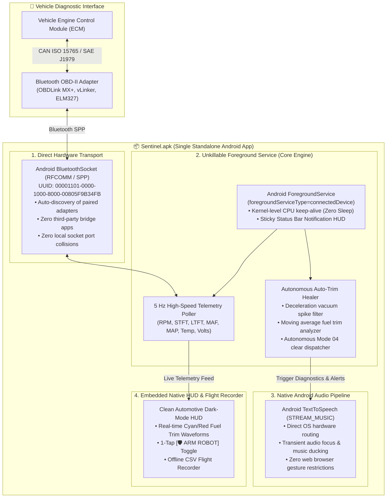

# 🚗 Car Sentinel: Standalone Android Package (`Sentinel.apk`) Product Architecture

**Date**: 2026-08-31  
**Author**: William Hanusiewicz (`naudiac`) & Antigravity  
**Repository**: `naudiac/utility-scripts`  
**Status**: DESIGN APPROVED • ANCHORED FOR IMPLEMENTATION  

---

## 📌 Executive Summary

This architecture specifies the first-principles transformation of the modular in-car vehicle telemetry and autonomous auto-trim healing prototype (previously running via Termux, Python, and `BT/TCP Bridge Pro`) into a single, standalone, commercial-grade Android Application Package (**`Sentinel.apk`**).

The design explicitly caters to **older and modern Android smartphones** (Android 7.0 Nougat / API 24 through Android 15 / API 35) with zero dependencies on third-party bridge apps, terminal environments, or manual command-line setups.

---

## 🏗️ First-Principles System Architecture

---

## 📱 Hardware & OS Compatibility Matrix

| Parameter | Specification | Purpose |
| :--- | :--- | :--- |
| **Minimum SDK** | `minSdk = 24` (Android 7.0 Nougat) | Full backward compatibility for phones back to 2016 (including older Galaxy devices). |
| **Target SDK** | `targetSdk = 34` (Android 14) | Compliance with modern Android security and foreground service type standards. |
| **Legacy Bluetooth** | `BLUETOOTH`, `BLUETOOTH_ADMIN`, `ACCESS_FINE_LOCATION` | Seamless execution on Android 11 and older (API $\le$ 30). |
| **Modern Bluetooth** | `BLUETOOTH_SCAN`, `BLUETOOTH_CONNECT` | Runtime permission requests on Android 12+ (API $\ge$ 31). |
| **Memory Footprint** | `< 25 MB RAM` | Smooth operation on low-spec 2GB/3GB RAM devices. |
| **Binary Footprint** | `< 4 MB APK` | Ultra-fast download and zero bloat. |

---

## 🔄 The Turnkey 1-Tap Experience for Dad

1. **One-Time Installation**:
   * William sends `Sentinel.apk` to Dad via WhatsApp or Google Drive.
   * Dad taps the file and presses **Install**.
   * Opens the app, selects his OBD adapter from paired devices, and taps **START GUARDIAN**.
2. **Everyday Commute (Zero Friction)**:
   * Dad starts his car.
   * Phone detects OBD Bluetooth link and announces:
     > *"Vehicle linked. Live telemetry active. Guardian armed."*
   * Dad locks his phone or runs Google Maps. The foreground service monitors fuel trims 24/7.
   * If a lean spike occurs ($\ge +22\%$), the robot automatically dispatches Mode 04 and announces:
     > *"Lean fuel trim spike cleared. Adaptations restored."*

---

## 🚀 Implementation Roadmap (When Resuming)

1. **Scaffold Project Structure**: Generate clean Gradle / Kotlin project with `empty-activity` template via `android create`.
2. **Implement RFCOMM & Foreground Service**: Port OBDLink communication loop and PID parser from `malibu_trim_sentinel.py`.
3. **Integrate Native Text-to-Speech & Canvas HUD**: Wire Android TTS audio ducking and real-time waveform view.
4. **Compile & Road Test**: Compile `Sentinel.apk` on PC, deploy to William's S24 Ultra for live road validation, and distribute to Dad.
